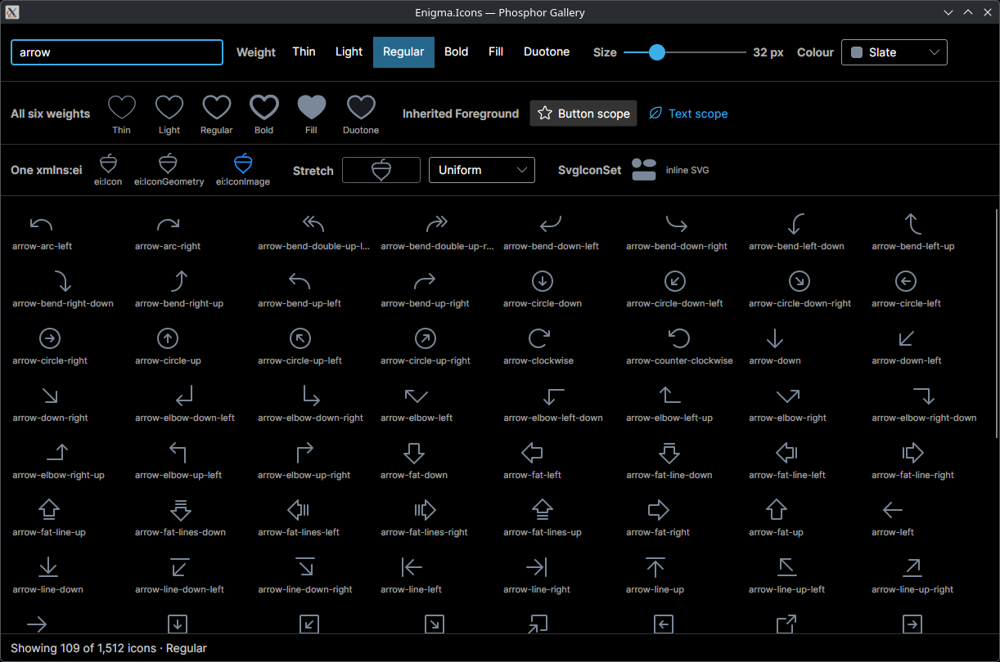

# Enigma.Icons

Icons for .NET, in three sibling packages under one umbrella: a **framework-agnostic icon model and
SVG parser**, the **Phosphor artwork as an interchangeable asset pack**, and an **Avalonia renderer**.
The artwork sits behind an open `IIconSet` abstraction, so you can take the batteries-included
Phosphor pack, point the same API at your own `.svg` files, or add another family as a new sibling
package rather than a fork. Dependencies are kept at the floor — **`Enigma.Icons` has no dependencies
at all**, and **`Enigma.Icons.Phosphor` has zero third-party dependencies**: it declares exactly one
package dependency, the sibling `Enigma.Icons`. All 1,512 Phosphor icons ship in all six weights,
duotone included.

> **What's new in 1.0** — first release of the Enigma.Icons umbrella — three sibling packages: the
> framework-agnostic core, the Phosphor asset pack, and the Avalonia renderer. See the
> [release notes](RELEASENOTES.md).

## Packages

**[Enigma.Icons](src/Enigma.Icons/README.md)** — the icon model, the hardened SVG parser, the
`IIconSet` abstraction, and bring-your-own-SVG support.
[](https://www.nuget.org/packages/Enigma.Icons)
[](LICENSE.md)

**[Enigma.Icons.Phosphor](src/Enigma.Icons.Phosphor/README.md)** — 1,512 Phosphor icons × 6 weights
as embedded resources behind a generated enum.
[](https://www.nuget.org/packages/Enigma.Icons.Phosphor)
[](LICENSE.md)

**[Enigma.Icons.Avalonia](src/Enigma.Icons.Avalonia/README.md)** — `Geometry`/`Drawing`/`DrawingImage`
conversion, two XAML markup extensions, and the `Icon` control.
[](https://www.nuget.org/packages/Enigma.Icons.Avalonia)
[](LICENSE.md)

## Which one do I need?

| Your situation | Install |
|---|---|
| An Avalonia app that wants icons | **`Enigma.Icons.Avalonia`** — it brings the other two with it |
| Not Avalonia, your own `.svg` files, or a renderer of your own | **`Enigma.Icons`** — the model, the parser, `SvgIconSet` |
| The Phosphor artwork with no renderer attached | **`Enigma.Icons.Phosphor`** |

A WPF sibling, `Enigma.Icons.Wpf`, is planned post-1.0 and is **not** part of this release.

## Quick start

```bash
dotnet add package Enigma.Icons.Avalonia
```

### XAML

One namespace declaration reaches the control **and** both markup extensions:

```xml
xmlns:ei="https://github.com/josueclement/Enigma.Icons"
```

```xml
<ei:Icon Kind="Acorn" Weight="Duotone" Size="24"
         Foreground="{DynamicResource SystemControlForegroundAccentBrush}" />

<Path Data="{ei:IconGeometry Acorn, Weight=Bold}" Fill="Black" Stretch="Uniform" />
<Image Source="{ei:IconImage Acorn, Weight=Fill, Brush=Red}" Width="24" Height="24" />
```

### C#

```csharp
using Enigma.Icons.Avalonia;
using Enigma.Icons.Phosphor;

var geometry = PhosphorIconSet.Instance
    .GetGlyph(PhosphorIcon.Acorn, PhosphorWeight.Bold)
    .ToGeometry();
```

## Supported target frameworks

| Package | Target frameworks |
|---|---|
| `Enigma.Icons` | `netstandard2.0` · `net8.0` · `net10.0` |
| `Enigma.Icons.Phosphor` | `netstandard2.0` · `net8.0` · `net10.0` |
| `Enigma.Icons.Avalonia` | `net8.0` · `net10.0` |

`Enigma.Icons.Avalonia` has no .NET Standard target because Avalonia 12 ships modern .NET assets
only.

## Gallery



The gallery sample filters all 1,512 icons by name as you type, switches the grid between the six
weights, and gives you a size slider and a foreground colour picker; click an icon to copy its XAML
snippet. It is the visual check unit tests cannot give you.

```bash
dotnet run --project samples/Enigma.Icons.Avalonia.Gallery
```

## App icon studio

A second desktop tool in this repository turns a Phosphor icon into an **application icon**: a rounded
plate — solid or a two-stop gradient, any colours — with the glyph on top in a colour of your own, and
a live preview at the sizes that actually matter. It writes a multi-frame `.ico` for
`<ApplicationIcon>` and standalone `.png` files for an About dialog or a splash window.

```bash
dotnet run --project tools/Enigma.Icons.AppIconStudio
```

Like the gallery and the asset generator, it is a maintainer's tool: not packable, and referenced by
nothing. See [`tools/Enigma.Icons.AppIconStudio/README.md`](tools/Enigma.Icons.AppIconStudio/README.md).

## Bring your own SVGs

`SvgIconSet` turns a directory, a file list, an assembly's embedded resources, or in-memory SVG text
into an `IIconSet` that every renderer here accepts — the built-in artwork has no privileged path.
See [`src/Enigma.Icons/README.md`](src/Enigma.Icons/README.md) for the worked example.

## Documentation

- [`Enigma.Icons`](src/Enigma.Icons/README.md) — the model, `IIconSet`, the parser and its documented
  limits, and your own SVG folders.
- [`Enigma.Icons.Phosphor`](src/Enigma.Icons.Phosphor/README.md) — the six weights, the generated
  enum, `PhosphorIconSet`, and how to refresh the artwork.
- [`Enigma.Icons.Avalonia`](src/Enigma.Icons.Avalonia/README.md) — the `Icon` control, the markup
  extensions, and the conversion extension methods.
- [`Enigma.Icons.AppIconStudio`](tools/Enigma.Icons.AppIconStudio/README.md) — the app-icon studio:
  what it writes, and how to wire the output into an app.
- [`docs/SPEC.md`](docs/SPEC.md) — the full design specification behind all of it.

## Credits

Icon artwork from Phosphor Icons (MIT), © 2020 Phosphor Icons — https://phosphoricons.com

The full notice ships with `Enigma.Icons.Phosphor` and is in
[THIRD-PARTY-NOTICES.md](THIRD-PARTY-NOTICES.md).

## Licence

MIT — see [LICENSE.md](LICENSE.md). The icon artwork is separately MIT-licensed by Phosphor Icons,
and its notice travels with the package that carries it.
